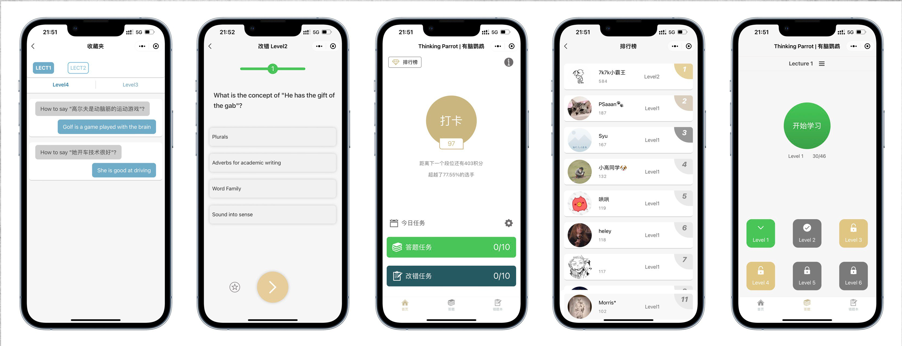

# Thinking Parrot Miniprogram | 有脑鹦鹉小程序



## Overview

**Thinking Parrot Miniprogram** is the WeChat Mini Program frontend for the Thinking Parrot AI-assisted English learning platform. This application provides an interactive, concept-first approach to mastering English, focusing on the patterns and thinking processes native speakers use unconsciously rather than traditional grammar drills and vocabulary memorization.

The miniprogram is designed specifically for Chinese native speakers learning English, offering a comprehensive learning experience through multiple interactive modules including concept learning, speech practice, AI chatbot conversations, and gamified progress tracking.

## Related Repositories

This repository is part of the **Thinking Parrot** ecosystem:

- **Main Repository**: [ThinkingParrot](https://github.com/liafonx/ThinkingParrot.git) - Core learning methodology and reference materials
- **Backend API**: [ThinkingParrot-Backend](https://github.com/liafonx/ThinkingParrot-Backend.git) - Django-based Python API service handling conversational AI and learning assessments
- **Frontend (This Repo)**: ThinkingParrot-Miniprogram - WeChat Mini Program user interface

## Key Features

### Multi-Level Learning System
- **Lecture 1 - Concept Introduction**: Example-based learning with detailed explanations (no answers required)
- **Lecture 2 - Concept Differentiation**: Multiple choice questions to distinguish between related concepts
- **Lecture 3 - Usage Review**: Multiple choice questions reviewing sentence usage and meaning
- **Lecture 4 - Speech Practice**: Voice recognition exercises for pronunciation mastery
- **Lecture 5**: Coming soon
- **Lecture 6 - AI Chatbot**: Natural English conversation practice with [Chatbot 3.0](https://github.com/liafonx/Language-Chatbot-3.0.git)

### Interactive Learning Features
- **Daily Check-in System**: Gamified attendance with points and streak bonuses
- **Progress Tracking**: Visual progress bars and achievement milestones
- **Wrong Question Bank**: Automatic collection of incorrectly answered questions for targeted review
- **Question Collection**: Bookmark important questions for later review
- **Ranking System**: Leaderboard to track progress against other learners
- **Customizable Goals**: Set daily learning targets (default: 10 questions/day)

### AI-Powered Features
- **Intelligent Chatbot**: Real-time conversational practice powered by backend AI
- **Speech Recognition**: Evaluate pronunciation accuracy with detailed feedback
- **Adaptive Learning**: Questions adjust based on user performance

### User Management
- **WeChat Integration**: Seamless login with WeChat profile
- **Progress Persistence**: Learning history synced across sessions
- **Points & Levels**: Earn points through daily activities and level up
- **Personal Statistics**: Track completed questions, accuracy rates, and streaks

## Key Pages

### Home (`pages/index`)
- Daily check-in with streak tracking
- Progress overview (questions completed vs. daily goal)
- Quick access to learning modules
- User level and points display
- Settings for customizing daily targets

### Learning Hub (`pages/learning`)
- Six learning lectures with progressive difficulty
- Lock/unlock system based on progress
- Introduction tooltips for first-time users
- Visual indicators for completed lectures

### Concept Learning (`pages/concept`)
- Example-based explanations
- Step-by-step concept introduction
- No-pressure learning environment

### Multiple Choice (`pages/choice`)
- Timed questions with visual countdown
- Immediate feedback on answers
- Collect interesting questions
- Submit wrong answers to review bank

### Speech Practice (`pages/speak`)
- Record and evaluate pronunciation
- Real-time scoring with visual feedback
- Listen to native speaker examples
- Progress tracking through audio questions

### AI Chatbot (`pages/chatbot`)
- Real-time conversation with AI
- Natural language understanding
- Context-aware responses
- Typing animation for better UX

### Wrong Questions (`pages/wrong`)
- Review all incorrectly answered questions
- Re-attempt with fresh perspective
- Track improvement over time

## Architecture

### Technology Stack
- **Framework**: WeChat Mini Program (原生开发)
- **Language**: JavaScript (ES6+)
- **UI Components**: WXML (WeChat Markup Language) + WXSS (WeChat Style Sheets)
- **Extended Libraries**: 
  - `kbone`: Multi-platform support
  - `weui`: WeChat UI component library

### Project Structure

```
miniprogram/
├── app.js                    # Application entry point & global configuration
├── app.json                  # Page routing & global settings
├── app.wxss                  # Global styles
│
├── data/                     # Static data files
│   ├── json.js              # Question bank data
│   ├── oral.js              # Oral practice questions
│   └── questions.js         # Question definitions
│
├── pages/                    # Application pages
│   ├── index/               # Home page with dashboard
│   ├── learning/            # Learning module selection
│   ├── concept/             # Concept learning (Lectures 1-3)
│   ├── choice/              # Multiple choice questions
│   ├── speak/               # Speech practice (Lecture 4)
│   ├── chatbot/             # AI chatbot interface (Lecture 6)
│   ├── wrong/               # Wrong question review
│   ├── collection/          # Collected questions
│   ├── ranking/             # User ranking leaderboard
│   ├── result/              # Quiz results display
│   └── intro/               # Introduction page
│
├── utils/                    # Utility functions
│   ├── base64.js            # Base64 encoding for audio
│   ├── prompt.js            # Toast & loading utilities
│   └── util.js              # Common utility functions
│
└── images/                   # Static image assets
```

## Getting Started

### Prerequisites
- WeChat Developer Tools ([Download](https://developers.weixin.qq.com/miniprogram/dev/devtools/download.html))
- WeChat Mini Program AppID (registered at [WeChat MP Platform](https://mp.weixin.qq.com/))
- Backend API server running (see [ThinkingParrot-Backend](https://github.com/liafonx/ThinkingParrot-Backend.git))

### Installation

1. **Clone the repository**
   ```bash
   git clone https://github.com/liafonx/ThinkingParrot-Miniprogram.git
   cd ThinkingParrot-Miniprogram
   ```

2. **Configure Backend URL**
   
   Update the backend API endpoint in `miniprogram/app.js`:
   ```javascript
   globalData: {
     urlDomain: 'https://your-backend-url.com/',  // Update this line
     // ...
   }
   ```

3. **Configure AppID**
   
   Update the `appid` in `project.config.json`:
   ```json
   {
     "appid": "your-wechat-appid-here",
     // ...
   }
   ```

4. **Open in WeChat Developer Tools**
   - Launch WeChat Developer Tools
   - Select "Import Project"
   - Choose the `ThinkingParrot-Miniprogram` directory
   - Enter your AppID when prompted

5. **Run the Application**
   - Click "Compile" in the developer tools
   - Test in the simulator or preview on a real device

### Backend Setup

This miniprogram requires the backend API to be running. Follow the setup instructions in the [ThinkingParrot-Backend](https://github.com/liafonx/ThinkingParrot-Backend.git) repository.

Key backend endpoints used:
- `/ChatbotGetMessage/` - AI chatbot conversations
- `/questionRecord/GetLectures/` - Fetch available lectures
- `/questionRecord/getNewQuestion/` - Get new questions
- `/questionRecord/getWrongQuestion/` - Get wrong questions for review
- `/questionRecord/signAddScore/` - Daily check-in
- `/questionRecord/getUserRank/` - Fetch user ranking
- `/questionRecord/userinfo` - User authentication

## User Flow

1. **Login**: User authorizes with WeChat profile
2. **Dashboard**: View daily goals, check-in streak, and learning progress
3. **Select Lecture**: Choose from 6 learning modules
4. **Complete Exercises**: 
   - Concept learning (Lectures 1-3)
   - Speech practice (Lecture 4)
   - AI chatbot (Lecture 6)
5. **Review Mistakes**: Access wrong question bank for targeted practice
6. **Track Progress**: View rankings, points, and achievements

## Data Storage

The miniprogram uses WeChat's local storage for:
- User authentication (`openid`)
- Learning progress (`questionDone`, `wrongDone`)
- Daily check-in status (`LastDay`, `checked`)
- Custom settings (`learnNum`, `wrongNum`)
- Cached user data (`indexInfo`, `userInfo`)

Data is synchronized with the backend for:
- Question records
- User statistics
- Ranking information
- Wrong question collections
